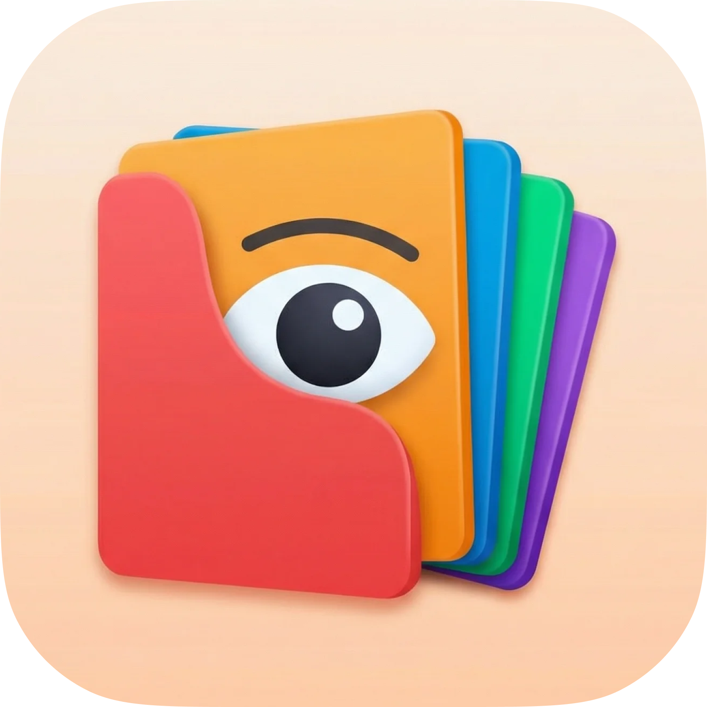
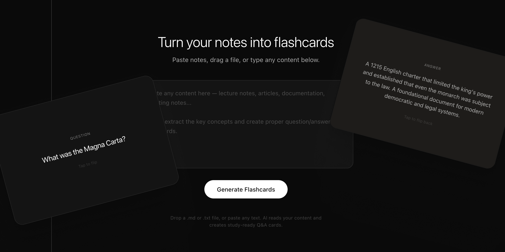

<p align="center">
  
</p>

<h1 align="center">Flip</h1>

<p align="center">Turn notes into flashcards to study.<br>
No AI API key required.</p>

<p align="center">Web · MIT</p>

<p align="center"><a href="https://flip.santiagoalonso.com"><strong>Try it live →</strong></a></p>

<p align="center">
  
</p>

---

## What it does

- **Built for studying** — for anyone who learns with flashcards. Exam prep, language practice, book notes, a PDF you need to drill. Bring the content, Flip handles the drill.
- **No API key, no account** — works with any AI you already use. Nothing to sign up for, nothing to install
- **Any LLM** — ChatGPT, Gemini, Claude, or local models
- **Try a demo** — a built-in Geography deck loads instantly if you want to see the study flow before making your own
- **Study flow** — tap to flip, mark each card as *I know it* or *I don't know*, track progress with a summary
- **Dark / light mode** — honors your system preference
- **Keyboard navigation** — arrows to move, space to flip
- **Local persistence** — deck, progress, and theme stored in `localStorage`. Per-browser, per-device. Clears when you clear your browser.

## How to create a deck

1. Copy the prompt from the new-deck screen (one click)
2. Paste it into ChatGPT, Gemini, Claude, or any other LLM
3. Tell it your topic (e.g. *"History of the UK"*) or attach a file — PDF, article, lecture notes
4. Copy the JSON response the AI returns
5. Paste it back into Flip — the deck loads automatically

No keys, no accounts, no backend. Flip is a prompt builder and a flashcard player.

## Run locally

```bash
npm install
npm run dev
# → http://localhost:5173
```

## Tech stack

- React 19 + TypeScript (Vite)
- Tailwind CSS v4
- No backend, no database, no third-party scripts — `localStorage` only

## Architecture

| Path | Purpose |
|------|---------|
| `src/components/FlashcardInput.tsx` | New-deck screen — copy prompt, paste JSON response |
| `src/components/FlashcardViewer.tsx` | Study view — flip, mark, navigate |
| `src/components/Header.tsx` | App logo + new deck + theme toggle |
| `src/hooks/useFlashcards.ts` | Deck state, persistence, progress tracking |
| `public/demo-*.json` | Demo decks — `demo-geography.json` is surfaced on the new-deck screen |

## Feedback

Found a bug or have an idea? [Open an issue](https://github.com/madebysan/flip/issues).

## License

[MIT](LICENSE)

---

Made by [santiagoalonso.com](https://santiagoalonso.com)
